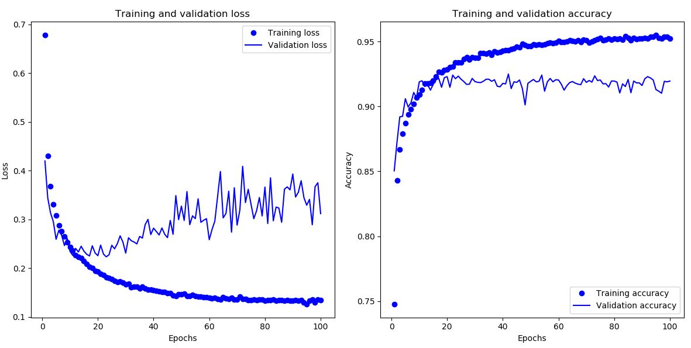
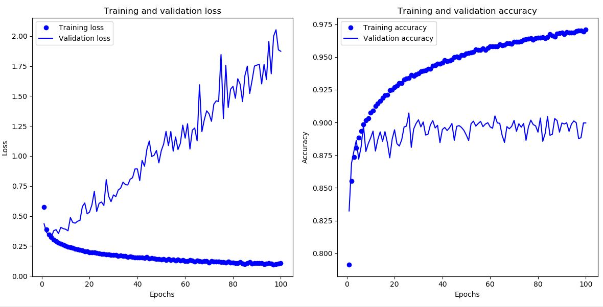

# About

This is a benchmark project for the FashionMNIST datasets. It uses an ensemble of Convolutional Neural Network, Dense Neural Network, Support Vector Classifier and Random Forest Classifier, implemented using Keras and scikit-learn, to archive an accuracy of 92.41% on the test set of FashionMNIST datasets.

The FashionMNIST datasets can be found at the following link:

https://keras.io/datasets/#fashion-mnist-database-of-fashion-articles

# Menu

* [About](#about)
* [Install required packages](#install-required-packages)
* [Download FashionMNIST datasets](#download-fashionmnist-datasets)
* [Use each classifier independently](#use-each-classifier-independently)
    - [Convolutional Neural Network (CNN)](#convolutional-neural-network-cnn)
        - [Training the model](#training-the-model)
        - [Verify the model](#verify-the-model)
        - [Predict the label of arbitrary input data](#predict-the-label-of-arbitrary-input-data)
    - [Dense Neural Network (DNN)](#dense-neural-network-dnn)
        - [Training the model](#training-the-model-1)
        - [Verify the model](#verify-the-model-1)
        - [Predict the label of arbitrary input data](#predict-the-label-of-arbitrary-input-data-1)
    - [Support Vector Classification (SVC)](#support-vector-classification-svc)
        - [Use cross-validation and grid-search to find optimized parameters for SVC](#use-cross-validation-and-grid-search-to-find-optimized-parameters-for-svc)
        - [Training the model](#training-the-model-2)
        - [Verify the model](#verify-the-model-2)
        - [Predict the label of arbitrary input data](#predict-the-label-of-arbitrary-input-data-2)
    - [Random Forest Classification](#random-forest-classification)
        - [Use cross-validation and grid-search to find optimized parameters for random forest](#use-cross-validation-and-grid-search-to-find-optimized-parameters-for-random-forest)
        - [Training the model](#training-the-model-3)
        - [Verify the model](#verify-the-model-3)
        - [Predict the label of arbitrary input data](#predict-the-label-of-arbitrary-input-data-3)
* [Use multi classifiers together](#use-multi-classifiers-together-model-ensembling)
    - [Create an object of class EnsemblesClassifier](#create-an-object-of-class-ensemblesclassifier)
    - [Set weight values to be used with each individual classifier](#set-weight-values-to-be-used-with-each-individual-classifier)
    - [Verify ensembling of models](#verify-ensembling-of-models)
    - [Predict the label of arbitrary input data](#predict-the-label-of-arbitrary-input-data-4)
    - [How to add additional classifier to model ensembling](#how-to-add-additional-classifier-to-model-ensembling)
* [License](#license)

# Install required packages

- On CPU-only machine:

        pip install -r requirements-cpu.txt

- On machine with NVIDIA CUDA compatible GPU:

        pip install -r requirements-gpu.txt

# Download FashionMNIST datasets

Use DataLoader class to download FashionMNIST datasets:

    from data_loader import DataLoader
    train_data = DataLoader().train_data
    train_labels = DataLoader().train_labels
    test_data = DataLoader().test_data
    test_labels = DataLoader().test_labels

The datasets will only be downloaded once, after that we can access it whenever we want using DataLoader class.

# Use each classifier independently

## Convolutional Neural Network (CNN)

Benchmark using Convolutional Neural Network is implemented in class *CNNClassifier* in *cnn_classifier.py*.

### Training the model

Create an object of class *CNNClassifier* and load training set and test set of FashionMNIST datasets:

    from cnn_classifier import CNNClassifier
    cnn_cl = CNNClassifier(load_data=True)

Call *train_model* method on object of class *CNNClassifier* above:

    cnn_cl.train_model(epochs=100, save_path='model/cnn.model.h5', save_history=True)

- *epochs*: the number of epochs to train model, default value is *100*.
- *save_path*: path to save trained model. This model uses the first 5000 observations of training set as validation set, only the model with the best validation accuracy will be saved.
- *save_history*: flag to determine whether to save validation accuracy and loss after each epoch to *history* folder or not. Can be used to recognize and fight overfitting. Default value is *False*.

If *save_history* flag is set to *True*, the following command can be used to display graph of validation accuracy/loss vs epochs:

    cnn_cl.check_loss_accuracy(history_path='history/CNNClassifier_yyyyMMddHHmmss.pkl')

for example:

    cnn_cl.check_loss_accuracy(history_path='history/CNNClassifier_20191201090807.pkl')
    

    

### Verify the model

Create an object of class *CNNClassifier*, load training set and test set of FashionMNIST datasets, then load a pre-trained model:

    from cnn_classifier import CNNClassifier
    cnn_cl = CNNClassifier(load_data=True)
    cnn_cl.load_model('model/cnn.model.h5')

Call *test_acc* method:

    cnn_cl.test_acc()

The accuracy and loss on test set of FashionMNIST will be calculated and returned as a dictionary:

`{'test_loss': <loss value>, 'test_acc':<accuracy value>}`

**Note**: with implemented network, the resulting model can reach an accuracy of 92.01% on test set of FashionMNIST datasets.

### Predict the label of arbitrary input data

**Note**: current model can only classify 28x28 pixels image. Input tensor must have one of the following shapes:
- (n, 28, 28, 1)
- (n, 28, 28)
- (n, 784)

Create an object of class *CNNClassifier* and load a pre-trained model. It is not necessary to load FashionMNIST datasets this time:

    from cnn_classifier import CNNClassifier
    cnn_cl = CNNClassifier(load_data=False)
    cnn_cl.load_model('model/cnn.model.h5')

Normalize input data to range [-1, 1] (if needed):

    input_data = input_data.astype('float32') / 255

Pass input data as a tensor to object of class *CNNClassifier*. Method *predict_proba* will return an *(n, 10)* matrix which hold the probability that each input data belongs to each class:

    cnn_cl.predict_proba(input_data)

While method *predict* will return an array of size *n* which hold the labels of classes with the highest probability.

    cnn_cl.predict(input_data)

## Dense Neural Network (DNN)

Benchmark using Dense Neural Network is implemented in class *DNNClassifier* in *dnn_classifier.py*.

### Training the model

Create an object of class *DNNClassifier* and load training set and test set of FashionMNIST datasets:

    from dnn_classifier import DNNClassifier
    dnn_cl = DNNClassifier(load_data=True)

Call *train_model* method on object of class *DNNClassifier* above:

    dnn_cl.train_model(epochs=100, save_path='model/dnn.model.h5', save_history=True)

- *epochs*: the number of epochs to train model, default value is *100*.
- *save_path*: path to save trained model. This model uses the first 5000 observations of training set as validation set, only the model with the best validation accuracy will be saved.
- *save_history*: flag to determine whether to save validation accuracy and loss after each epoch to *history* folder or not. Can be used to recognize and fight overfitting. Default value is *False*.

If *save_history* flag is set to *True*, the following command can be used to display graph of validation accuracy/loss vs epochs:

    dnn_cl.check_loss_accuracy(history_path='history/DNNClassifier_yyyyMMddHHmmss.pkl')

for example:

    dnn_cl.check_loss_accuracy(history_path='history/DNNClassifier_20191201090807.pkl')

    

### Verify the model

Create an object of class *DNNClassifier* load training set and test set of FashionMNIST datasets, then load a pre-trained model:

    from dnn_classifier import DNNClassifier
    dnn_cl = DNNClassifier(load_data=True)
    dnn_cl.load_model('model/dnn.model.h5')

Call *test_acc* method:

    dnn_cl.test_acc()

The accuracy and loss on test set of FashionMNIST will be calculated and returned as a dictionary:

`{'test_loss': <loss value>, 'test_acc':<accuracy value>}`

**Note**: with implemented network, the resulting model can reach an accuracy of 89.51% on test set of FashionMNIST datasets.

### Predict the label of arbitrary input data

**Note**: current model can only classify 28x28 pixels image. Input tensor must have one of the following shapes:
- (n, 28, 28, 1)
- (n, 28, 28)
- (n, 784)

Create an object of class *DNNClassifier* and load a pre-trained model. It is not necessary to load FashionMNIST datasets this time:

    from dnn_classifier import DNNClassifier
    dnn_cl = DNNClassifier(load_data=False)
    dnn_cl.load_model('model/dnn.model.h5')

Normalize input data to range [-1, 1] (if needed):

    input_data = input_data.astype('float32') / 255

Pass input data as a tensor to object of class *DNNClassifier*. Method *predict_proba* will return an *(n, 10)* matrix which hold the probability that each input data belongs to each class:

    dnn_cl.predict_proba(input_data)

While method *predict* will return an array of size *n* which hold the labels of classes with the highest probability.

    dnn_cl.predict(input_data)

## Support Vector Classification (SVC)

Benchmark using Support Vector Classification is implemented in class *SVCClassifier* in *svc_classifier.py*.

### Use cross-validation and grid-search to find optimized parameters for SVC

Create an object of class *SVCClassifier* and load training set and test set of FashionMNIST datasets:

    from svc_classifier import SVCClassifier
    svc_cl = SVCClassifier(load_data=True)

Create a parameters grid to specify the search space for grid-search. For example:

    param_grid = {'C': [0.001, 0.01, 0.1, 1, 10, 100],
                    'gamma': ['auto_deprecated', 0.001, 0.01, 0.1, 1, 10, 100],
                    'kernel': ['linear', 'rbf']}

Call method cross_validation on object of class *SVCClassifier*:

    svc_cl.cross_validation(param_grid=param_grid, cv=2, max_obs=10000)

- *param_grid*: parameters grid created above.
- *cv*: value of k in k-th fold cross-validation.
- *max_obs*: the maximum number of observations in training data used in cross-validation. Default is *None* (use all observations in training set in cross-validation). SVC does not scale very well; it is recommended to set *max_obs* to a value smaller than *10000* on normal PC.

### Training the model

Create an object of class *SVCClassifier* and load training set and test set of FashionMNIST datasets:

    from svc_classifier import SVCClassifier
    svc_cl = SVCClassifier(load_data=True)

Call *train_model* method on object of class *SVCClassifier* above:

    svc_cl.train_model(save_path='model/svc.model.pkl', max_obs=10000,
                        gamma=.01, C=10, kernel='rbf')

- *save_path*: path to save trained model.
- *max_obs*: the maximum number of observations in training set used to train model. Default is *None* (use all observations in training set to train model). SVC does not scale very well; it is recommended to set *max_obs* to a value smaller than *10000* on normal PC.
- *gamma*: *gamma* parameter to be used in SVC. Default is *'auto_deprecated'*.
- *C*: *C* parameter to be used in SVC. Default is *1.0*.
- *kernel*: *kernel* option to be used in SVC. Default is *linear*.

### Verify the model

Create an object of class *SVCClassifier*, load training set and test set of FashionMNIST datasets, then load a pre-trained model:

    from svc_classifier import SVCClassifier
    svc_cl = SVCClassifier(load_data=True)
    svc_cl.load_model('model/svc.model.pkl')

Call *test_acc* method:

    svc_cl.test_acc()

The accuracy on test set of FashionMNIST will be calculated and returned as a dictionary:

`{'test_acc':<accuracy value>}`

**Note**: with *max_obs=10000*, *gamma=0.01*, *C=10*, *kernel='rbf'*, the resulting model can reach an accuracy of 86.69% on test set of FashionMNIST datasets.

### Predict the label of arbitrary input data

**Note**: current model can only classify 28x28 pixels image. Input tensor must have one of the following shapes:
- (n, 28, 28, 1)
- (n, 28, 28)
- (n, 784)

Create an object of class *SVCClassifier* and load a pre-trained model. It is not necessary to load FashionMNIST datasets this time:

    from svc_classifier import SVCClassifier
    svc_cl = SVCClassifier(load_data=False)
    svc_cl.load_model('model/svc.model.pkl')

Normalize input data to range [-1, 1] (if needed):

    input_data = input_data.astype('float32') / 255

Pass input data as a tensor to object of class *SVCClassifier*. Method *predict_proba* will return an *(n, 10)* matrix which hold the probability that each input data belongs to each class:

    svc_cl.predict_proba(input_data)

While method *predict* will return an array of size *n* which hold the labels of classes with the highest probability.

    svc_cl.predict(input_data)

## Random Forest Classification

Benchmark using Random Forest Classification is implemented in class *RFClassifier* in *random_forest_classifier.py*.

### Use cross-validation and grid-search to find optimized parameters for random forest

Create an object of class *RFClassifier* and load training set and test set of FashionMNIST datasets:

    from random_forest_classifier import RFClassifier
    rf_cl = RFClassifier(load_data=True)

Create a parameters grid to specify the search space for grid-search. For example:

    param_grid = {'n_estimators': [140, 150, 160, 170, 180],
                    'min_samples_split': [2, 3, 4, 5]}

Call method cross_validation on object of class *RFClassifier*:

    rf_cl.cross_validation(param_grid=param_grid, cv=2, max_obs=None)

- *param_grid*: parameters grid created above.
- *cv*: value of k in k-th fold cross-validation.
- *max_obs*: the maximum number of observations in training data used in cross-validation. Default is *None* (use all observations in training set in cross-validation).

### Training the model

Create an object of class *RFClassifier* and load training set and test set of FashionMNIST datasets:

    from random_forest_classifier import RFClassifier
    rf_cl = RFClassifier(load_data=True)

Call *train_model* method on object of class *RFClassifier* above:

    rf_cl.train_model(save_path='model/rf.model.pkl', max_obs=None,
                        n_estimators=160, min_samples_split=2)

- *save_path*: path to save trained model.
- *max_obs*: the maximum number of observations in training set used to train model. Default is *None* (use all observations in training set to train model).
- *n_estimators*: *n_estimators* parameter to be used in random forest classification. Default is *10*.
- *min_samples_split*: *min_samples_split* parameter to be used in random forest classification. Default is *2*.

### Verify the model

Create an object of class *RFClassifier*, load training set and test set of FashionMNIST datasets, then load a pre-trained model:

    from random_forest_classifier import RFClassifier
    rf_cl = RFClassifier(load_data=True)
    rf_cl.load_model('model/rf.model.pkl')

Call *test_acc* method:

    rf_cl.test_acc()

The accuracy on test set of FashionMNIST will be calculated and returned as a dictionary:

`{'test_acc':<accuracy value>}`

**Note**: with *max_obs=None*, *n_estimators=160*, *min_samples_split=2*, the resulting model can reach an accuracy of 87.82% on test set of FashionMNIST datasets.

### Predict the label of arbitrary input data

**Note**: current model can only classify 28x28 pixels image. Input tensor must have one of the following shapes:
- (n, 28, 28, 1)
- (n, 28, 28)
- (n, 784)

Create an object of class *RFClassifier* and load a pre-trained model. It is not necessary to load FashionMNIST datasets this time:

    from random_forest_classifier import RFClassifier
    rf_cl = RFClassifier(load_data=False)
    rf_cl.load_model('model/rf.model.pkl')

Normalize input data to range [-1, 1] (if needed):

    input_data = input_data.astype('float32') / 255

Pass input data as a tensor to object of class *RFClassifier*. Method *predict_proba* will return an *(n, 10)* matrix which hold the probability that each input data belongs to each class:

    rf_cl.predict_proba(input_data)

While method *predict* will return an array of size *n* which hold the labels of classes with the highest probability.

    rf_cl.predict(input_data)

# Use multi classifiers together (model ensembling)

In most cases, an ensemble of multiple different classifiers can archive higher accuracy than any individual classifier. The reason is each classifier looks at slightly different aspects of the data to make its predictions, getting part of the truth but not all of it.

By pooling their perspectives together, we can get a far more accurate description of the data. As the old saying goes, "The Whole is Greater than the Sum of its Parts".

Model ensembling is implemented in class EnsemblesClassifier in ensembles_classifier.py.

## Create an object of class EnsemblesClassifier

Create of list of different classifiers. In this example we use the 4 classifiers in previous section. We also need to load pre-trained model for each classifier:

    from cnn_classifier import CNNClassifier
    cnn_cl = CNNClassifier(load_data=True)
    cnn_cl.load_model('model/cnn.model.h5')
    from dnn_classifier import DNNClassifier
    dnn_cl = DNNClassifier(load_data=True)
    dnn_cl.load_model('model/dnn.model.h5')
    from svc_classifier import SVCClassifier
    svc_cl = SVCClassifier(load_data=True)
    svc_cl.load_model('model/svc.model.pkl')
    from random_forest_classifier import RFClassifier
    rf_cl = RFClassifier(load_data=True)
    rf.load_model('model/rf.model.pkl')

**Note**: in-order to use method *fit_ensembles_weight* of class EnsemblesClassifier, each individual classifier must copy and store FashionMNIST datasets locally by setting *load_data=True*. Alternatively, if *load_data* is omitted, the default value for that flag will be *True*.

    cnn_cl = CNNClassifier() # equals to cnn_cl = CNNClassifier(load_data=True)

Create an object of class EnsemblesClassifier and pass the list of individual classifiers created above:

    from ensembles_classifier import EnsemblesClassifier
    classifier_list = [cnn_cl, dnn_cl, svc_cl, rf_cl]
    en_cl = EnsemblesClassifier(classifier_list=classifier_list)

It is also possible to create an object of class EnsemblesClassifier first then pass the list of individual classifiers later:

    en_cl = EnsemblesClassifier()
    en_cl.classifier_list = [cnn_cl, dnn_cl, svc_cl, rf_cl]

## Set weight values to be used with each individual classifier

While it is possible to just average the predictions of all classifiers and use that average value as output of ensembles classifier, this will only work if all classifiers are more or less equally good.
If one of them is significantly worse than the others, the final predictions may not be as good as the best classifier of the group.

The smarter way is to use the weighted average; better classifier will have higher weight, while worse classifier will have lower weight.
Let the accuracy of model i be Xi, then model ensembling works best when the weight of each model is proportional to *(1-Xi)^-2*.

We can use method *fit_ensembles_weight* of class EnsemblesClassifier to automatically calculate and set the best weight for each individual classifier:

    en_cl.fit_ensembles_weight()

The weights of all individual classifiers will be store in *ensembles_weight_list* of *en_cl*.

**Note**: as noted in previous section, *ensembles_weight_list* only works if all individual classifiers have copied and stored FashionMNIST locally.

Alternatively, it is possible to set *ensembles_weight_list* directly with arbitrary values. For example, to set weight of all 4 individual classifiers to 0.25:

    en_cl.ensembles_weight_list = [.25, .25, .25, .25]

**Note**: if the length of *ensembles_weight_list* does not match the length of *classifier_list*, an exception will be raised.

## Verify ensembling of models

Copy and normalize the test set of FashionMNIST datasets:

    from data_loader import DataLoader
    test_data = DataLoader().test_data
    test_data = test_data.astype('float32') / 255
    test_labels = DataLoader().test_labels

Perform prediction on test set:

    pred_labels = en_cl.predict(test_data)

Calculate and display accuracy:

    import numpy as np
    acc = np.sum(pred_labels == test_labels) / test_labels.shape[0]
    print('Accuracy on test set: ', acc)

**Note**: the model ensembling of the following individual classifiers can reach an accuracy of 92.41% on test set of FashionMNIST datasets:
- CNN classifier with 92.01% accuracy, 0.4218 weight.
- DNN classifier with 89.51% accuracy, 0.2447 weight.
- SVC classifier with 86.69% accuracy, 0.1520 weight.
- RFC classifier with 87.82% accuracy, 0.1815 weight.

## Predict the label of arbitrary input data

**Note**: current model can only classify 28x28 pixels image. Input tensor must have one of the following shapes:
- (n, 28, 28, 1)
- (n, 28, 28)
- (n, 784)

Normalize input data to range [-1, 1] (if needed):

    input_data = input_data.astype('float32') / 255

Pass input data as a tensor to object of class *EnsemblesClassifier*. Method *predict_proba* will return an *(n, 10)* matrix which hold the probability that each input data belongs to each class:

    en_cl.predict_proba(input_data)

While method *predict* will return an array of size *n* which hold the labels of classes with the highest probability.

    en_cl.predict(input_data)

## How to add additional classifier to model ensembling

In this project, we have created an ensemble of Convolutional Neural Network, Dense Neural Network, Support Vector Classifier and Random Forest Classifier. However, there still are many other classifiers we can use.
Any classifier which implements the following properties and methods can be added to *classifier_list* and *EnsemblesClassifier* will seamlessly use its predictions with given weight along with other classifiers to predict the labels of input data.
- *model*: stores the classification model, trained using training datasets of FashionMNIST.
- *train_data* and *train_labels*: training datasets of FashionMNIST.
- *test_data* and *test_labels*: test datasets of FashionMNIST.
- *load_data()*: downloads FashionMNIST dataset, divides it into training and test datasets, and performs pre-processing (if needed).
- *predict_proba(data)*: returns a (n, 10) matrix, which holds the probability that each item in input data belongs to each of the 10 categories.
- *test_acc()*: returns a dictionary, which must have a key called *test_acc*, storing the accuracy when testing this classifier on the test datasets of FashionMNIST.

**Note**: *test_acc()* is not 100% required, if you set *ensembles_weight_list* manually instead of using *fit_ensembles_weight*, you can skip this method.

# License

MIT License

https://opensource.org/licenses/MIT